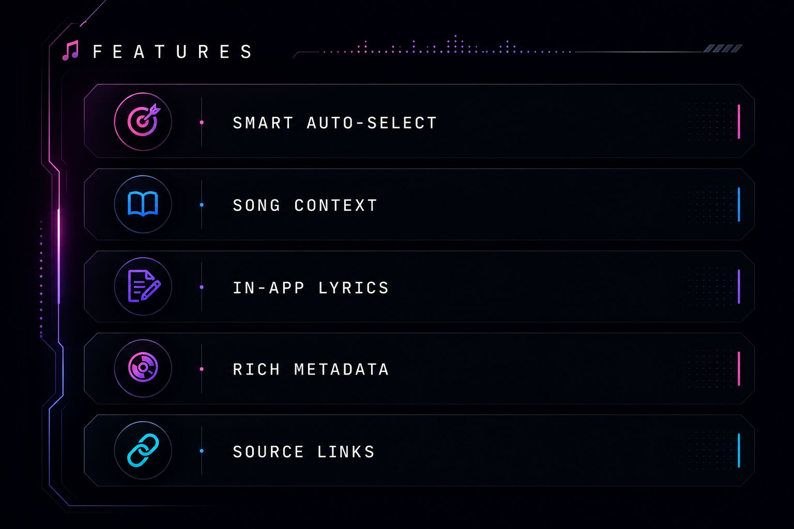
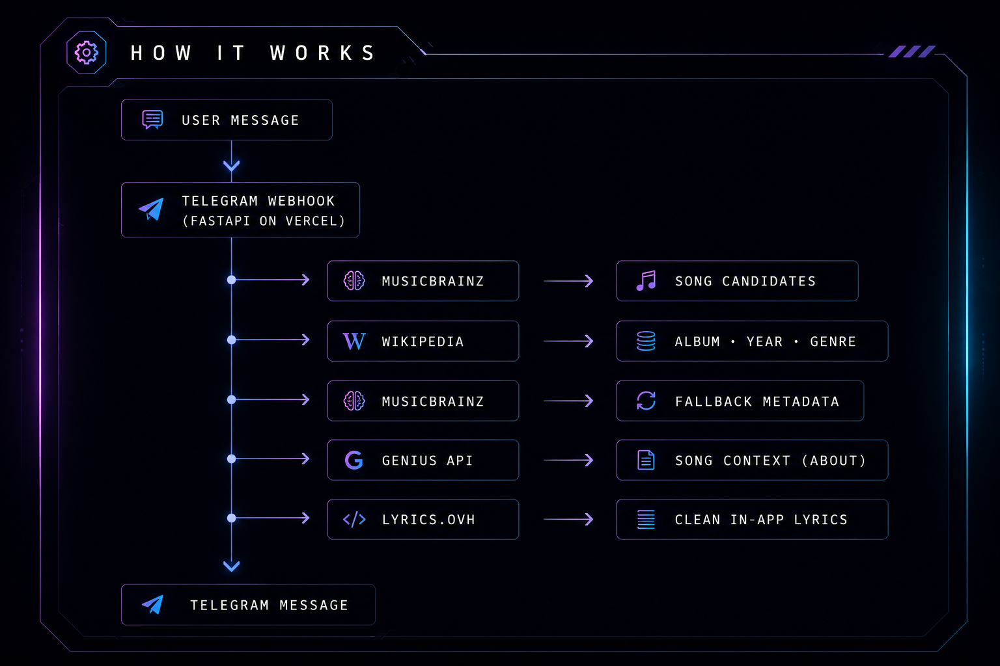

<div align="center">

```
███████╗ ██████╗██╗  ██╗ ██████╗      █████╗ ████████╗██╗      █████╗ ███████╗
██╔════╝██╔════╝██║  ██║██╔═══██╗    ██╔══██╗╚══██╔══╝██║     ██╔══██╗██╔════╝
█████╗  ██║     ███████║██║   ██║    ███████║   ██║   ██║     ███████║███████╗
██╔══╝  ██║     ██╔══██║██║   ██║    ██╔══██║   ██║   ██║     ██╔══██║╚════██║
███████╗╚██████╗██║  ██║╚██████╔╝    ██║  ██║   ██║   ███████╗██║  ██║███████║
╚══════╝ ╚═════╝╚═╝  ╚═╝ ╚═════╝     ╚═╝  ╚═╝   ╚═╝   ╚══════╝╚═╝  ╚═╝╚══════╝
```

**Your music. Decoded.**

[](https://t.me/echoatlasbot)
[](https://python.org)
[](https://fastapi.tiangolo.com)
[](https://vercel.com)
[](LICENSE)

</div>

---

## ◈ What is EchoAtlas?

EchoAtlas is a **Telegram bot** that turns any song name into a full music brief like artist, album, year, genre, context of the track, and the special thing is it can provide you clean in-app lyrics, all without leaving Telegram.

No Ads! No Redirects! No Noise!

---

## ◈ Features



---

## ◈ Built With

| Layer | Technology |
|---|---|
| **Language** | Python 3.14.2 |
| **Bot Framework** | python-telegram-bot |
| **Web Framework** | FastAPI |
| **Deployment** | Vercel |
| **Song Search** | MusicBrainz API |
| **Metadata** | Wikipedia API |
| **Song Context** | Genius API |
| **Lyrics** | Lyrics.ovh |
| **HTML Parsing** | BeautifulSoup4 |

---

## ◈ How It Works



---

## ◈ Built By

**@sarav26-git** - designed, coded and deployed from scratch

---

<div align="center">

*EchoAtlas - every song has a story that worth knowing!*

</div>
